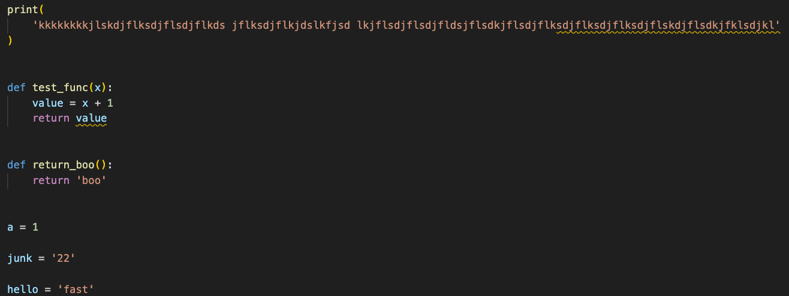

<!-- omit from toc --> 
# Jeanette’s starter kit for packaging using uv (VS Code, uv, ruff, pytest, pre-commit)


Updated: September 29, 2025 

Will probably be obsolete: October 31, 2025

⚠️ Quick ChatGPT (or whatever LLM) warning:  In my experience (as of 9/29/2025) these resources do *not* always give great advice on using `uv`.  If the ever suggest activating the environment and making changes I DO NOT recommend this.  It will almost always result in a `pyproject.toml` that doesn't align with the `.venv`, which somewhat defeats the purpose of having a `pyproject.toml`.  In this case, go old school and look the help documentation for `uv` directly or get sassy with your LLM about giving better advice. 

- [Introduction](#introduction)
- [Dive in: A step-by-step toy example](#dive-in-a-step-by-step-toy-example)
  - [About this example](#about-this-example)
  - [Initialize a package](#initialize-a-package)
  - [Ruff](#ruff)
    - [Add setting to pyproject.toml](#add-setting-to-pyprojecttoml)
    - [Set up VS Code so it will automatically lint/format on save and notebook cell execution (optional)](#set-up-vs-code-so-it-will-automatically-lintformat-on-save-and-notebook-cell-execution-optional)
    - [See how what you just did works](#see-how-what-you-just-did-works)
  - [Pytest](#pytest)
    - [Make a test](#make-a-test)
    - [Supply pytest with the test location](#supply-pytest-with-the-test-location)
    - [Manually run test using uv run](#manually-run-test-using-uv-run)
    - [Set up a github action](#set-up-a-github-action)
  - [Pre-commit hook](#pre-commit-hook)
- [Further Details on the Steps](#further-details-on-the-steps)
  - [VS Code (some Ruff)](#vs-code-some-ruff)
  - [UV](#uv)
    - [Why is UV so great?](#why-is-uv-so-great)
    - [Basics to get started](#basics-to-get-started)
    - [Helpful more advanced `git add` examples](#helpful-more-advanced-git-add-examples)
  - [Ruff](#ruff-1)
  - [Pytest](#pytest-1)
    - [Integrate Pytest with github via a workflow](#integrate-pytest-with-github-via-a-workflow)
  - [Pre-commit hooks](#pre-commit-hooks)


# Introduction

These are my personal notes on packaging using VS Code, uv, ruff, pytest, and pre-commit hooks, based on what I’ve learned over the past month. While these notes are tailored to my preferences, I’ve explained specific choices where relevant. Feedback is welcome!

I begin by going through all of the steps with little explanation (Dive in: A step-by-step toy example) followed by a section (Further Details on the Steps) with a little more detail and with links to resources that I found useful. 


# Dive in: A step-by-step toy example


## About this example

This is a super basic workflow for setting up a new package that includes setting up VS Code to work the way I prefer, initializing the package with uv, setting up Ruff the way I currently like it, setting up a place for my tests, setting up pytest as a workflow and setting up pre-commit hooks that I currently prefer.  The sections that follow have slightly more detailed notes that I’ve taken about each of these steps, including some YouTube links I’ve found to be useful.

Assumption: VS Code, Ruff and pre-commit are installed and I’m using a Mac.  In VS Code I have the following extensions (not all of these are necessary for this, but these are nice): Ruff, Python, Python Debugger, GitHub Copilot, Markdown All In One, YAML.

## Initialize a package

- FYI, if your github token doesn’t allow for workflows, the workflow part of this will fail later on. So you’ve been warned.
- cd to the where you want to create your new package. The code below will create the new package in a local repository, create a github repo and run the initial push to github.
    - I read that it is more common/readable to separate words with dashes in urls, so I use dashes in my repository name.
    - Python will not be happy with underscores for names of module imports, so I use the underscore for my package name.
    
    ```bash
    uv init --package my_uv_test
    cd my_uv_test 
    
    # (You may not need this)
    # Authenticate with GitHub using your account
    auth login
    
    # Now you can create the github repo easily
    gh repo create my-uv-test --public
    
    # initial push to github
    git add -A
    git commit -m 'initial commit'
    git remote add origin https://github.com/jmumford/my-uv-test.git
    # More common to use main branch instead of master
    git branch -M main
    git push -u origin main
    
    # Open workspace in VS Code
    code ./
    ```
    
- If you already know some of your dependencies, go ahead an add them (you should add pytest no matter what at this point and ipykernel is necessary if you want Ruff to play nice with your notebooks)
    - If you `ls -a` before and after you’ll see this creates your `.venv` directory
    - I have gathered that it is customary to be amazed by how quickly uv installs packages, so make sure to say “wow” while it installs stuff
    
    ```bash
    uv add pandas numpy
    uv add --dev pytest ipykernel
    ```
    - Advance uv adds are below (directly from github repos and from local cloned repos in editable mode)

## Ruff

### Add setting to pyproject.toml

- In VS Code (open as workspace), open `pyproject.toml` and paste this at the end
    
    ```toml
    [tool.ruff]
    extend-include = ["*.ipynb"]
    
    [tool.ruff.format]
    quote-style = "single"
    
    [tool.ruff.lint]
    extend-select = ["E501", "W", "N", "R", "I"]
    ```
    
    - Allows Ruff to work on notebooks, enforces single quotes and extends default linting (default: `E4, E7, E9, and F` , all lint rules are [here](https://docs.astral.sh/ruff/rules/)) to include line-too-long (E501), warnings (W), pep8-naming (N), refactor(R), isort (I).  Ruff includes blue/black and so much more, so it makes a lot of sense to use it (IMHO).

### Set up VS Code so it will automatically lint/format on save and notebook cell execution (optional)

- I’ve decided I will only use this by default for my personal packages and perhaps with care if I’m working with somebody else’s code (just use their lint/format preferences instead)
- In VS Code hit `command + ,` to open the settings
    - Change tab to `Workspace` do ***not*** add these changes to `User`
    - Click on the little page with the circle arrow in the upper right hand corner to open the settings.json file (note, this is in `.vscode/settings.json`
    - Put the following in the `settings.json` file
        
        ```json
        {
            "notebook.formatOnSave.enabled": true,
            "notebook.formatOnCellExecution": true,
            "notebook.defaultFormatter": "charliermarsh.ruff",
            "notebook.codeActionsOnSave": {
                "notebook.source.fixAll": "explicit",
                "notebook.source.organizeImports": "explicit",
            },
            "[python]": {
                "editor.formatOnSave": true,
                "editor.defaultFormatter": "charliermarsh.ruff",
                "editor.codeActionsOnSave": {
                    "source.fixAll": "explicit",
                    "source.organizeImports": "explicit",
                }
            },
        }
        ```
        
    - **IMPORTANT:** *Add* this to the `.gitignore`(don’t delete what is already in the file. The first bit is for .vscode and the second bit is just useful for junk files created by the OS that aren’t already included in the `.gitignore`
        
        ```bash
        # VS Code settings
        .vscode
        
        # OS generated files 
        .DS_Store
        .DS_Store?
        ._*
        .Spotlight-V100
        .Trashes
        ehthumbs.db
        Thumbs.d
        ```
        
- Now Ruff will just magically fix your code (or alert you to things you must fix).  The following section is optional, but shows it in action and will give the future pre-commit hook a reason to throw linting errors.

### See how what you just did works

- To see things work (if this is just for practice), create a python module and I purposely make some typos for Ruff to fix later (a line that is too long, spacing around equal sign and I’m using double quotes when Ruff will format to single quotes).
    
    ```bash
    touch src/my_uv_test/some_things.py
    ```
    
    - Open some_things.py and add this (or whatever you’d like) to it.  I’m purposely using poor formatting here.  Note, I use `return_boo()` later on in a test example.
    
    ```bash
    print(
        'kkkkkkkkjlskdjflksdjflsdjflkds jflksdjflkjdslkfjsd lkjflsdjflsdjfldsjflsdkjflsdjflksdjflksdjflksdjflskdjflsdkjfklsdjkl'
    )
    
    def test_func(x):
        value = x + 1
        return value
    
    def return_boo():
        return 'boo'
    
    a = 1
    
    junk="22"
    
    hello = "fast"
    ```
    
    - Save it and check it out!  It should look like this with the quotes/spacing fixed and if you hover above the squiggle lines it will describe the linting issue.  I’m leaving those put for now, so the pre-commit hook can find some problems.
        
        
        
    - If you were to create a new .ipynb file, open it, select the .venv (it is already in the directory since we used `uv add`).  You can test that Ruff is working by typing something incorrectly and running the cell.  It will automatically fix what it can (formatting issues) and will underline linting errors for you to fix!

## Pytest

### Make a test

- Create directory/file: `mkdir tests` followed by `touch tests/some_things_test.py`. I like to name the test files using the python module name followed by test.
- Here’s a really simple test (add this to `some_things_test.py`)

```python
from my_uv_test.some_things import return_boo

def test_return_boo():
    assert return_boo() == 'boo'

```

### Supply pytest with the test location

- Add the test location to the `pyproject.toml` file (paste this at the end)
    
    ```toml
    [tool.pytest.ini_options]
    testpaths=['tests/tests_to_run.py']
    ```
    

### Manually run test using uv run

- `uv run pytest`
- Should produce this output!
    
    
    

### Set up a github action

- Set up a `.yaml` to define your workflow configuration
    
    ```bash
    # From main directory
    mkdir -p .github/workflows
    touch .github/workflows/run_tests.yaml
    ```
    
- Add this to the run_tests.yaml
    - This needs improvement and I’ll revise as I learn more about tests
    
    ```yaml
    name: Run tests
    
    on:
      push:
        branches:
          - main
    
    jobs:
      uv-run-tests:
        name: python
        runs-on: ubuntu-latest
    
        steps:
          - uses: actions/checkout@v4
    
          - name: Install uv
            uses: astral-sh/setup-uv@v4
    
          - name: Set up Python
            run: uv python install
    
          - name: Install the project
            run: uv sync --all-extras --dev
    
          - name: Run tests
            run: uv run pytest
    ```
    
- Engage!
    - (note, poor-ish form to add -A, but I’m using it here)
        
        ```bash
        git add -A
        git commit -m 'updating and testing run_tests'
        git push origin main
        ```
        
    - Pop open the github repo and click on Actions tab. Shazam!
        
        
        

## Pre-commit hook

You can add pre-commit hooks to your repository, but you can't enforce their use like tests. If you're contributing to someone else's repo, set up the hooks to align with their lint/format settings. I’m undecided about running hooks every time I push to GitHub, but it's easy to skip and run manually later.

- Install pre-commit (if you haven’t already).  Totally cool to install system-wide.  Again, this is a user-specific step (not like a test), so it wouldn’t be a dependency you’d add via uv.
    - `pip install pre-commit`
- Install the Git hooks in your repository (run this in your root directory)
    - `pre-commit install`
    - output is: `pre-commit installed at .git/hooks/pre-commit`
- Configure the environment
    - In the root directory create `.pre-commit-config.yaml`
    - Dump this in `.pre-commit-config.yaml` (see main pre-commit hook section below to learn more about these choices)
        
        ```yaml
        repos:
          - repo: https://github.com/astral-sh/uv-pre-commit
            # uv version.
            rev: 0.5.9
            hooks:
              # Update the uv lockfile
              - id: uv-lock
        
          - repo: https://github.com/astral-sh/ruff-pre-commit
            # Ruff version.
            rev: v0.8.3
            hooks:
              # Run the linter.
              - id: ruff
                args: [ --fix ]
              # Run the formatter.
              - id: ruff-format
        
          - repo: https://github.com/RobertCraigie/pyright-python
            rev: v1.1.391
            hooks:
              - id: pyright
        
        ```
        
        - IMPORTANT:  If you’re using pyright, you need to add this to the `pyproject.toml`
            
            ```toml
            [tool.pyright]
            exclude = ['.venv']
            venvPath = '.'
            venv = '.venv'
            ```
            
- Engage!
    - Ruff/pyright will only run on files that are staged for commit, so make a new edit  to and save  `some_things.py` if you’d like to see ruff/pylint in action.
    - You can run via a commit.  Assuming you left the some of the lint errors in your code, you should get this after running `git add -A` and `git commit -m 'new files and test hook'`
    - If the lint errors were left in the `some_things.py` file, the output will look something like this
        
        
        
    - After I fixed the errors it ran fine and I could push the changes to github
- Commit without Engaging
    - use: `git commit -m 'message' --no-verify`
- Run pre-commit without running git-commit
    - use: `pre-commit run --all-files`
    - Note, this is not a `uv run` situation because pre-commit was installed system-wide

# Further Details on the Steps

## VS Code (some Ruff)

- This [video](https://www.youtube.com/watch?v=PwGKhvqJCQM) is useful, and dives into uv a bit
- How to make a “fresh” install of VS Code
    - Deleting from applications isn’t enough!
    - Also delete `$HOME/Library/Application Support/Code` and `~/.vscode`
- I added these extensions to VS Code (`command + shift + X` brings up Extension Marketplace)
    - Ruff, Python, Python Debugger, GitHub Copilot, Markdown All In One, YAML (I’m horrible at spotting indentation errors in yaml files!)
    - Why Ruff?
        - It integrates nicely with VS Code
        - It is very fast and can implement rules of blue or black and is easy to set up (I’m sure other linters and formatters are too)
- Ruff linting will automatically start working by underlining errors, but will not catch formatting errors unless you run the ruff formatter manually.  Although you can change VS Code settings to automate it.
    - Linting = errors that may prevent code from working
    - Formatting = makes code pretty
- Although I do often set the automatic formatting upon save/cell run in the VS Code settings, I only do this on the level of a Workspace and do not set this up in the more broad User settings.
    - I often work on other people’s code and I don’t want to mess up their preferences
    - Check if a project has lint/formatting settings in the pyproject.toml or equivalent and if there is a pre-commit hook
        - If details are in pyproject.toml you can either manually run ruff (or whatever linter is used) or set up the .vscode/settings.json as needed.  Just add .vscode to the .gitignore if you do this!
        - If in the pre-commit hook, just enable the hook to run and use it
    - If this is my own project or there aren’t lint/format settings, I’ll set workspace VS Code settings along with a ruff.toml file with my favorite settings
- Things that would be fine to adjust in the User settings
    - The appearance of VS Code (I don’t care about this)
    - Not sure what else.  I’m fine with it as it is currently
- When it is okay for me to automatically apply Ruff lint/format on save or code execution in a notebook (with auto fix).  These are my current favorite settings and how I put it together.
    - Open directory in VS Code as workspace
        - I typically just cd into the directory and type `code ./`
    - Press `command + ,` to open settings within VS Code
    - Change settings tab to `Workspace`
    - Open the json by clicking the icon in the upper right hand corner of the window that looks like a page with an arrow on it
        
        
        
    - Note, this created a `.vscode/settings.json` file for you in your workspace!  Here are my favorite settings so far.  See Ruff documentation if you need more info and I have a brief section on it below.
    
    ```json
    {
        "notebook.formatOnSave.enabled": true,
        "notebook.formatOnCellExecution": true,
        "notebook.defaultFormatter": "charliermarsh.ruff",
        "notebook.codeActionsOnSave": {
            "notebook.source.fixAll": "explicit",
            "notebook.source.organizeImports": "explicit",
        },
        "[python]": {
            "editor.formatOnSave": true,
            "editor.defaultFormatter": "charliermarsh.ruff",
            "editor.codeActionsOnSave": {
                "source.fixAll": "explicit",
                "source.organizeImports": "explicit",
            }
        },
    }
    ```
    
    - Next, for some reason Ruff won’t automatically apply to `ipynb` files and I like to tweak the settings a bit.  Super easy to do using a `ruff.toml` .  Create the file in the workspace root and here’s what I like to add.  See Ruff documentation for details. Mostly I want more specific linting and I hate double quotes, so I change that as well.
    
    ```toml
    extend-include = ["*.ipynb"]
    
    [format]
    quote-style = "single"
    
    [lint]
    extend-select = ["E501", "W", "N", "R", "I"]
    ```
    
    - Last, but not least, if this is part of a github repository, I add `.vscode` to the `.gitignore` file, but I allow the `ruff.toml` file to get pushed to the repo since others can then use it.
    - Ta-da! It just automatically works.  This takes less than a minute to set up and it has a huge impact on how my code looks.

## UV

### Why is UV so great?

- It is very fast (e.g. at loading libraries)
- I think it is pretty cool because the .venv is contained within the package and it just sort of works
    - Easy to use to run notebooks
    - Just use `uv run` to run code without requiring the user to activate an environment
        - e.g., for my GUI the user just needs to use `uv run src/main_gui.py` from the package directory and this will run with the proper dependencies regardless of the environment the person launches the command from!
- I have nothing to compare it to, but it is very easy to manage the dependencies and update the `pyproject.toml` file, which is what is used to create the environment, `.venv`
- It automatically sets up the directory structure for an application or package for you
- I’m sure there are more reasons why, but since I’m new to all of this and this is mostly what I know, it is hard to make comparisons from my experience

### Basics to get started

These are common commands and descriptions for files that are created/used.

- `uv init <application name>`
    - This generates an application, which isn’t likely that useful for me.  Applications are good for web servers, scripts and command-line interfaces.  To be honest, I’m not completely sure what that all means, but it lacks the ability to install as a package because it isn’t a package.  I *believe* this can easily be changed by adding a `__init__.py` to a directory, but I’m really not sure and am still learning about this.
    - Run it to see what files it makes if you’re curious
- `uv init --package <package name>`
    - This will make a package!  The difference is that there’s a build system defined (in pyproject.toml file) and there are other necessary files and a directory structure that makes it a package
    - If I run `uv init --package test_package` this is the directory structure/files created (I used `tree`  to get this)
        
        ```bash
        test_package
        ├── .git
        ├── .gitignore
        ├── .python-version
        ├── README.md
        ├── pyproject.toml
        └── src
            └── test_package
                └── __init__.py
        ```
        
    - How I have set things up is to add my module files in `src/test_package`  directly and I also have a subdirectory with Data for one case.  This makes it easy to load data and functions in python code/notebooks
    - Pretty great that it generates a .gitignore file automatically.  It is a good start, but I always add the following to it (assuming I’ll be adding a .vscode directory)
        
        ```bash
        # ignore vscode settings
        .vscode/
        
        ### macOS ###
        # General
        .DS_Store
        .AppleDouble
        .LSOverride
        ```
        
    - For my current project, aside from the modules, the main files are notebooks and I put them in the main directory within a subdirectory, `test_package/manuscript_code/` .  If I need to import a function called `calc_values` from a file `test_package/src/test_package/utils.py` within a notebook, I’d simply use `from test_package.utils import calc_values` , for example.
- `uv add dependency1 dependency2`
    - How to add dependencies.  They will be added to the pyproject.toml file and .venv
    - The first time you do this the .venv will be created
- `uv add ipykernel`
    - Use this if the package will include python notebooks
- `uv sync`
    - Recall the .venv will not be pushed to github (nor would you want it to be), so a user working with a clone can create the project environment (or update it if dependencies have been manually added to the `pyproject.toml`)
    - Specific group dependencies can be added using `uv sync -group groupname`
    - By default all groups of dependencies are installed (I believe)
- `uv.lock` file
    - The `uv.lock` file keeps track of **exact versions** of those dependencies that were installed when you set up or updated your project
- `uv run`
    - How you run a command from your project
    - This will automatically use the .venv from the project (super cool)
    - Example:`uv run pytest`
        - Assuming you’ve already added pytest as a dependency!
        - How you run the tests (pytest is in next section)
        - A cool bit about this is if you’ve manually added dependencies to the `pyproject.toml` file, you don’t need to uv sync first, this will automatically update the dependencies and then run the test.
            - Note, if you were not running a test and you manually changed the pyproject.toml, you’d want to run `uv sync` to add the new dependencies (or whatever you changed)
    - `uvx run`
        - This runs things in a temporary environment and is like an alias for uv tool run
        - The temporary environment only includes whatever dependency is needed for the command that is being run (e.g., to run ruff, it will temporarily install ruff and run it)
        - If you need other dependencies within the package’s environment, use `uv run` instead
        - Why would you use this?  If you don’t already have the .venv for your package and you’re just running something simple, uvx run may be faster.

### Helpful more advanced `git add` examples
- You should never activate the `.venv` to add a package or use `uv pip install` because it is likely creating a mismatch between your `pyproject.toml` and your local `.venv`, which interferes with reproducibility down the line. Here are two special git adds I find myself using a lot
  - *Directly add a tool from github*
    - `uv add git+https://github.com/jmumford/randomise-prep.git@6c73254`
      - By using the commit hash you fix to that specific version
  - *Add a local copy of a cloned (perhaps forked) repo in editable mode*
      - Note, this does not live within the uv-controlled project you're adding it to!  Use case, I'm working on a PR for fitlins and my uv-controlled package contains code for testing my repairs.
      - `uv add --editable path/to/local/copy/forked/fitlins/`


## Ruff

- Most of the Ruff info is in the VS Code section, but here are a few other tidbits I wanted to remember
- `ruff.toml` vs adding to `pyproject.toml` ?
    - I like the idea of simply using the `pyproject.toml` , but if I had a large number of settings or if my `pyproject.toml` was already fairly involved, it might be cleaner to use the `ruff.toml` instead.
    - If I’m working with somebody else’s repository and they already have a `pyproject.toml` (or equivalent) but don’t have any linting/formatting tools specified, I’d set up my own `ruff.toml` and make sure it didn’t get pushed to the repo if I submitted a PR.
    - Lint rules can be found [here](https://docs.astral.sh/ruff/rules/) (these are set in `extend-select`)

## Pytest

- I have an example in the first main section
- I’m not going to get into the nitty gritty about writing the tests because I don’t know much yet
    - See [here](https://docs.pytest.org/en/stable/) to get started
    - Also, recall useful things like `@pytest.fixture`  ([fixtures](https://docs.pytest.org/en/6.2.x/fixture.html)) which allows you to define something once and use it over and over in different tests.

### Integrate Pytest with github via a workflow

- See example above BUT if you you get an error message about tokens not allowing workflows you need to use a different token
    - If you get [this](https://github.com/orgs/community/discussions/26254) error message, then follow [this](https://www.geeksforgeeks.org/how-to-authenticate-git-push-with-github-using-a-token/) to fix it.

## Pre-commit hooks

- Here’s a [good video](https://www.youtube.com/watch?v=xhg1dJHLqSM).  The idea is to streamline the CI pipeline (continuous integration).  The video example check thats the uv.lock is consistent with pyproject.toml, lints code, formats the code, runs pyright (sort of like a python spell checker?  I need to learn more about this), runs the tests, and builds the project into a wheel (he skips this for the precommit hook)
- Something I was originally confused about: precommit hooks aren’t settings that you can enforce all contributors to a project to use (like the workflows) since the hooks are defined in the local `.git/hooks` directory.
    - Chris adds a pre-commit.config file and (I believe) hopes people will use it
        - I didn’t use it when I submitted a PR to fitlins, but he said he often forgets too (whew)
    - Hooks are more developer-specific and also may not run on all platforms
    - They are usually in place as “helpers”, not something to be enforced
- Note, the `.git/hooks/` directory already has a bunch of `.sample` files, but those are not used unless you rename without `.sample`.  The `pre-commit install` command is creating a new `pre-commit` file that I’m guessing is better to use than the pre-commit.sample file (with sample removed).
- [Pre-commit](https://pre-commit.com/) is the tool to use!  See the toy example in the first section for details about setting this up.
- Where did the yaml code come from?  Just google it
    - First is from [here](https://github.com/astral-sh/uv-pre-commit) (uv hooks), then pyright [here](https://pypi.org/project/pyright/), and ruff [here](https://github.com/astral-sh/ruff-pre-commit).  Note, pyright needs a section in the pyproject.yaml too
- To skip running the pre-commit hooks just add `--no-verify` to the git commit command
- To run without a commit use `pre-commit run --all-files`